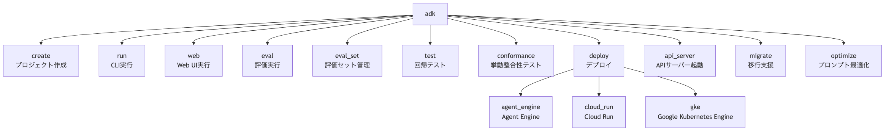

# 付録A ADK CLIリファレンス

> **このページについて**：書籍『現場で役立つ マルチエージェント設計入門 ～ADK × A2Aで実装する実践運用ガイド～』（為藤アキラ 著）の付録A「ADK CLIリファレンス」を、著者がオンライン閲覧用に転載したものです。内容はADK v2.2.0を基準とします。本文中の「第N章」は書籍の章を指します。このページの本文と掲載図版は書籍の一部であり、リポジトリのライセンス（Apache License 2.0）の対象外です（© 2026 Akira Tameto）。誤りを見つけた場合は[Issue](https://github.com/tameto/adk-multi-agent-book/issues)で報告してください。

ADK（Agent Development Kit、エージェント開発キット）のCLI（Command Line Interface）は、エージェントの作成・実行・評価・デプロイを1つのコマンドラインでカバーするツールです。本書の各章で登場したコマンドを、オプション・使用例・注意点を含めてまとめます。

```bash
pip install "google-adk==2.2.0"   # インストール（uvも使用可）
adk --version                      # バージョン確認
```

本書のサンプルコードはADK v2.2.0を前提とします。ADK 2.x内でもCLIやAPIが変わる可能性があるため、更新時も`pip install -U "google-adk==2.2.0"`のように固定バージョンを明示してください。

ADK CLIのコマンド体系を図A-1に示します。



**図A-1 ADK CLIコマンド体系の全体像**

主要サブコマンドを表A-1に示します。

**表A-1 ADK主要サブコマンド一覧**

| サブコマンド | 概要 | 本書の参照章 |
|---|---|---|
| `create` | プロジェクトスキャフォールディング | 第2章 |
| `run` | CLIでエージェントを対話的に実行 | 第2章 |
| `web` | ブラウザUIでエージェントをテスト | 第2章 |
| `eval` | 評価セットの実行 | 第5章 |
| `eval_set` | 評価セットの生成・管理 | 第5章 |
| `test` | `.test.json`による回帰テスト | - |
| `conformance` | 挙動整合性テスト | 第7章 |
| `deploy` | 本番環境へのデプロイ | 第8章 |
| `api_server` | Web UIなしのAPIサーバーの起動（A-3節参照） | - |
| `migrate` | 旧形式データの移行支援 | - |
| `optimize` | GEPAプロンプト最適化 | 第8章 |

## A-1 adk create

`adk create`は、ADKエージェントプロジェクトの雛形を生成するコマンドです（第2章参照）。

### コマンド構文

```bash
adk create [OPTIONS] APP_NAME
```

### オプション一覧

`adk create`のオプションを表A-2に示します。

**表A-2 adk createオプション一覧**

| オプション | 型 | デフォルト | 説明 |
|---|---|---|---|
| `APP_NAME` | 文字列 | 必須 | 生成するプロジェクトの名前 |
| `--model` | 文字列 | なし | 使用するLLM。未指定時は対話で選択する |
| `--api_key` | 文字列 | なし | Google AI Studio APIキー（Vertex AI非使用時） |
| `--project` | 文字列 | 環境変数から取得 | Google CloudプロジェクトID |
| `--region` | 文字列 | 環境変数から取得 | Google Cloudリージョン |

### 使用例

```bash
# プロジェクト作成（モデル等は表A-2のオプションで指定）
adk create my_agent
```

実行すると`my_agent/`配下に`__init__.py`、`agent.py`、`.env`の3ファイルが生成されます。`agent.py`の`root_agent`変数が、`adk run`/`adk web`の検出エントリポイントです。

### 注意点

- `APP_NAME`にはPythonのモジュール名として有効な文字列（ハイフン不可、アンダースコア可）を指定します
- `.env`ファイルにはAPIキーが平文で記録されます。`.gitignore`に追加してください

## A-2 adk run

`adk run`は、ターミナル上でエージェントを対話的に実行するコマンドです。対話の終了は`exit`または`Ctrl+C`です。

### コマンド構文

```bash
adk run [OPTIONS] AGENT [QUERY]
```

### オプション一覧

`adk run`のオプションを表A-3に示します。

**表A-3 adk runオプション一覧**

| オプション | 型 | デフォルト | 説明 |
|---|---|---|---|
| `AGENT` | パス | 必須 | エージェントのディレクトリパス |
| `QUERY` | 文字列 | なし | 単発実行するユーザーメッセージ。省略時は対話モード |
| `--enable_features` | 文字列 | なし | 実験的機能名をカンマ区切りで有効化 |
| `--disable_features` | 文字列 | なし | 実験的機能名をカンマ区切りで無効化 |
| `--save_session` | フラグ | `false` | セッションをJSONファイルに保存する |
| `--session_id` | 文字列 | なし | 保存時のセッションID |
| `--session_service_uri` | 文字列 | なし | Session ServiceのURI（A-10節参照） |
| `--artifact_service_uri` | 文字列 | なし | Artifact ServiceのURI（A-10節参照） |
| `--use_local_storage` / `--no_use_local_storage` | フラグ | `--use_local_storage` | 明示的なサービスURI未指定時にローカル`.adk`ストレージを使う |
| `--memory_service_uri` | 文字列 | なし | Memory ServiceのURI（A-10節参照） |
| `--replay` | ファイル | なし | 初期状態とユーザー入力を含むJSONを非対話で再生 |
| `--resume` | ファイル | なし | 保存済みセッションJSONから再開 |
| `--state` | JSON文字列 | なし | 実行開始時の初期State |
| `--timeout` | 期間文字列 | なし | 1ターン/1クエリのタイムアウト（例：`30s`、`5m`） |
| `--in_memory` | フラグ | `false` | セッションデータを永続化せずインメモリで実行 |
| `--jsonl` | フラグ | `false` | 人間向け表示ではなく構造化JSONLで出力 |
| `--default_llm_model` | 文字列 | なし | エージェントがmodelを明示しない場合の既定LLM |

### 使用例

```bash
# セッションをSQLiteに永続化して実行
adk run ./my_agent --session_service_uri "sqlite:///sessions.db"

# 単発クエリをJSONLで実行
adk run ./my_agent "東京の天気を教えて" --jsonl
```

### トラブルシューティング

よくあるエラーと対処法を表A-4に示します。

**表A-4 adk runトラブルシューティング**

| エラーメッセージ | 原因 | 対処法 |
|---|---|---|
| `ModuleNotFoundError: No module named 'google.adk'` | ADKがインストールされていない | `pip install "google-adk==2.2.0"`を実行 |
| `No root_agent found for '<agent_name>'.` | `agent.py`に`root_agent`変数がない | 変数名を`root_agent`に修正 |
| `GOOGLE_API_KEY not set` | APIキーが未設定 | `.env`に`GOOGLE_API_KEY`を設定、またはVertex AIモードを使用 |
| `Permission denied` | Google Cloud認証の不備 | `gcloud auth application-default login`を実行 |
| `Model not found` | 指定したモデルが利用不可 | モデル名を利用可能なものに変更 |

### 注意点

- `--no_use_local_storage`または`ADK_DISABLE_LOCAL_STORAGE=1`を指定した場合や、実行環境でローカル書き込みが使えない場合はインメモリにフォールバックします
- `--session_service_uri`にSQLiteを指定する場合、URLのプレフィックスは`sqlite:///`（スラッシュ3つ）です

## A-3 adk web

`adk web`は、ブラウザUIでエージェントをテスト実行するコマンドです。

### コマンド構文

```bash
adk web [OPTIONS] [AGENTS_DIR]
```

`AGENTS_DIR`にはエージェントプロジェクトを含む親ディレクトリ、または単一エージェントのディレクトリを指定します。親ディレクトリを指定した場合は、複数のエージェントをUIのドロップダウンで切り替えられます。

### オプション一覧

`adk web`のオプションを表A-5に示します。

**表A-5 adk webオプション一覧**

| オプション | 型 | デフォルト | 説明 |
|---|---|---|---|
| `AGENTS_DIR` | パス | カレントディレクトリ | エージェントディレクトリの親パス |
| `--port` | 整数 | `8000` | Webサーバーのポート番号 |
| `--host` | 文字列 | `127.0.0.1` | Webサーバーのホストアドレス |
| `--eval_storage_uri` | 文字列 | なし | Web UIから使う評価結果ストレージURI（例：`gs://...`） |
| `--log_level` | 文字列 | `INFO` | ログレベル（debug / info / warning / error / critical） |
| `-v` / `--verbose` | フラグ | `false` | デバッグログを有効化（`--log_level debug`の短縮形） |
| `--allow_origins` | 文字列（複数指定可） | なし | CORS（Cross-Origin Resource Sharing）許可オリジン。複数指定する場合はオプションを繰り返す（カンマ区切りは不可）。`regex:`プレフィックスで正規表現指定も可 |
| `--a2a` | フラグ | `false` | A2A（Agent2Agent、エージェント間通信プロトコル）サーバーモードで起動 |
| `--reload` / `--no-reload` | フラグ | `--reload` | 開発用の自動リロードを有効化/無効化 |
| `--reload_agents` | フラグ | `false` | エージェント定義の再読み込みを有効化 |
| `--trace_to_cloud` | フラグ | `false` | Cloud Traceへの送信を有効化 |
| `--otel_to_cloud` | フラグ | `false` | OpenTelemetryのCloud送信を有効化 |
| `--extra_plugins` | 文字列 | なし | 追加プラグインを指定 |
| `--url_prefix` | 文字列 | なし | リバースプロキシ配下で使うURLプレフィックス |
| `--trigger_sources` | 文字列 | なし | イベントトリガーのソースを指定 |
| `--logo-text` / `--logo-image-url` | 文字列 | なし | Web UIのロゴ表示を指定 |

`adk run`と共通のオプション（`--enable_features`、`--disable_features`、`--session_service_uri`、`--artifact_service_uri`、`--use_local_storage`、`--memory_service_uri`、`--default_llm_model`）は表A-3と同じ書式です。なお、`adk api_server`はAPIサーバーのみを起動するコマンドで、サービスURI等の主要オプションは`adk web`と共通です（`--default_llm_model`と`--logo-text`等のUI表示系は`adk web`専用です）。

開発用APIとして、アプリ一覧は`GET /list-apps`、エージェントメタ情報は`GET /apps/{app_name}/app-info`で取得できます（旧`/app-info/{app_name}`は不可）。

### 使用例

```bash
# WebUIで起動
adk web .

# ポート・ホスト・ログレベルを指定
adk web . --host 0.0.0.0 --port 8080 --log_level debug
```

### adk run と adk web の使い分け

両者の比較を表A-6に示します。

**表A-6 adk runとadk webの比較**

| 観点 | `adk run` | `adk web` |
|---|---|---|
| インターフェース | ターミナル（CLI） | ブラウザ（WebUI） |
| 複数エージェント | 1つずつ指定 | 複数を同時読み込み |
| イベント可視化 | なし | イベントビューアで可視化 |
| State確認 | ログ出力で確認 | リアルタイムインスペクター |
| CI/CD連携 | `--replay`で自動化可能 | 不向き |
| 推奨用途 | 簡易テスト、スクリプト実行 | デバッグ、デモ、チーム共有 |

### 注意点

- `adk run`と`adk web`はローカル開発専用です。本番環境では`adk deploy`を使用してください
- `--host 0.0.0.0`は他のマシンからのアクセスを許可します。セキュリティに注意してください

## A-4 adk eval / adk eval_set

`adk eval`と`adk eval_set`は、エージェントの品質を定量的に評価するコマンドです（第5章参照）。

### adk eval（評価の実行）

**コマンド構文**

```bash
adk eval [OPTIONS] AGENT_DIR [EVAL_SET_FILE_PATH_OR_ID]...
```

ADK v2.2.0のヘルプ文には古い引数名 `AGENT_MODULE_FILE_PATH` が残っていますが、実装上は `__init__.py` ファイルではなくエージェントディレクトリを指定します。本書では実行時の受理条件に合わせて `AGENT_DIR` と表記します。

**オプション一覧**

`adk eval`のオプションを表A-7に示します。

**表A-7 adk evalオプション一覧**

| オプション | 型 | デフォルト | 説明 |
|---|---|---|---|
| `AGENT_DIR` | パス | 必須 | `agent.py`で`root_agent`を公開するエージェントディレクトリ |
| `EVAL_SET_FILE_PATH_OR_ID` | パス/ID | 任意 | 評価セットファイルまたは評価セットID（複数可） |
| `--config_file_path` | パス | なし | 評価設定ファイル（JSON） |
| `--print_detailed_results` | フラグ | `false` | 詳細な評価結果を表示 |
| `--eval_storage_uri` | 文字列 | なし | 評価結果の保存先URI |
| `--log_level` | 文字列 | `INFO` | ログレベル（debug / info / warning / error / critical） |

**使用例**

```bash
# 評価の実行（詳細結果も表示）
adk eval ./my_agent eval_set.json \
  --config_file_path eval_config.json \
  --print_detailed_results
```

### 評価セットファイルの形式

評価セットファイル（JSON）の各フィールドの意味は表A-8の通りです。具体的なJSON例は第5章を参照してください。

**表A-8 評価セットファイルのフィールド一覧**

| フィールド | 必須 | 説明 |
|---|---|---|
| `eval_set_id` | はい | 評価セットID |
| `eval_cases` | はい | 評価ケースの配列 |
| `eval_cases[].eval_id` | はい | 評価ケースID |
| `eval_cases[].conversation` | △（`conversation_scenario`と排他。どちらか一方が必須） | `Invocation`配列。マルチターンでは要素を順に追加 |
| `conversation[].user_content` | はい | ユーザー入力（`Content`形式） |
| `conversation[].final_response` | いいえ | 期待される応答テキスト（`Content`形式） |
| `conversation[].intermediate_data.tool_uses` | いいえ | 期待されるツール呼び出し（`FunctionCall`形式） |
| `eval_cases[].conversation_scenario` | △（`conversation`と排他。どちらか一方が必須） | User Simulation用の会話シナリオ。`conversation`と両方指定または両方省略すると`EvalCase`のバリデーションエラーになる |

### 評価設定ファイルの形式

評価設定ファイルの`criteria`には、各評価メトリクスの合格閾値を指定します。メトリクスの一覧と値の範囲は第5章を参照してください。

```json
{
  "criteria": {"tool_trajectory_avg_score": 1.0, "response_match_score": 0.8}
}
```

### 評価結果の読み方

全テストケースの全メトリクスが閾値を満たすと`PASS`、1つでも満たさないと`FAIL`です。出力例と判断フローは第5章を参照してください。

### adk eval_set（評価セットの管理）

**サブコマンド**

`adk eval_set`のサブコマンドを表A-9に示します。

**表A-9 adk eval_setサブコマンド一覧**

| サブコマンド | 説明 |
|---|---|
| `create` | 新しい評価セットを作成 |
| `add_eval_case` | `ConversationScenarios`と`SessionInput`から評価ケースを追加 |
| `generate_eval_cases` | User Simulation用設定から評価ケースを生成 |

**使用例**

```bash
adk eval_set create ./my_agent regression_set
adk eval_set add_eval_case ./my_agent regression_set \
  --scenarios_file scenarios.json \
  --session_input_file session_input.json
adk eval_set generate_eval_cases ./my_agent persona_set \
  --user_simulation_config_file user_simulation_config.json
```

### User Personas（ユーザーペルソナ評価）

ADK v2.2.0のUser Simulationは、通常の旧形式評価セットJSONへ`user_persona`を直書きするのではなく、`ConversationScenario`の`user_persona`として定義します。`adk eval_set add_eval_case`で追加する`scenarios.json`（`user_persona`定義を含む）の具体例は第5章を参照してください。

Vertex AI Eval SDKでシナリオ自体を生成する場合は、`count`、`generation_instruction`、`environment_context`、`model_name`を含む`ConversationGenerationConfig`のJSONを`--user_simulation_config_file`へ渡します。

### 注意点

- `final_response`は厳密な一致ではなく、設定した評価メトリクスに応じた類似度で評価されます。LLM-as-a-judge系メトリクスは実行ごとにスコアが微小に変動するため、コストとレート制限に注意が必要です
- 評価に失敗すると終了コード`1`が返されるため、CIパイプラインでジョブを自動的に失敗させられます

## A-5 adk test

`adk test`は、指定フォルダ配下のエージェント用`.test.json`ファイルをpytestで実行するコマンドです。対話の期待値を軽量な回帰テストとして固定したい場合に使います。

### コマンド構文

```bash
adk test [OPTIONS] [FOLDER]
```

### オプション一覧

`adk test`のオプションを表A-10に示します。

**表A-10 adk testオプション一覧**

| オプション | 型 | デフォルト | 説明 |
|---|---|---|---|
| `FOLDER` | パス | カレントディレクトリ | エージェントとテストJSONを含むフォルダ |
| `--rebuild` | フラグ | `false` | 実エージェントを実行してテストファイルを再生成 |

### 使用例

```bash
adk test ./my_agent
adk test ./my_agent --rebuild
```

## A-6 adk optimize

`adk optimize`は、GEPA（Genetic-Pareto）によって`root_agent`のInstructionを最適化するコマンドです（第8章参照）。評価セットを直接渡すのではなく、LocalEvalSampler用の設定ファイルで学習・検証に使うeval configとeval setを指定します。

### コマンド構文

```bash
adk optimize [OPTIONS] AGENT_DIR
```

### オプション一覧

`adk optimize`のオプションを表A-11に示します。

**表A-11 adk optimizeオプション一覧**

| オプション | 型 | デフォルト | 説明 |
|---|---|---|---|
| `AGENT_DIR` | パス | 必須 | `agent.py`で`root_agent`を公開するエージェントディレクトリ |
| `--sampler_config_file_path` | ファイル | 必須 | LocalEvalSampler設定ファイル |
| `--optimizer_config_file_path` | ファイル | なし | GEPA optimizer設定ファイル |
| `--print_detailed_results` | フラグ | `false` | 最適化結果の詳細を表示 |
| `--log_level` | 文字列 | `INFO` | ログレベル |

### 使用例

```bash
adk optimize ./my_agent \
  --sampler_config_file_path optimize/sampler_config.json \
  --print_detailed_results
```

## A-7 adk migrate

`adk migrate`は、旧形式のADK関連データを現行スキーマへ移行するためのコマンド群です。ADK v2.2.0では、セッションDBスキーマの移行を行う`session`サブコマンドを提供します。

```bash
adk migrate session --help
```

実行前に対象DBのバックアップを取得し、移行後は`adk run`や`adk web`で既存セッションが読めることを確認してください。

## A-8 adk conformance

`adk conformance`は、記録済みのADK実行と現在の実装の整合性を検証するコマンドです。A2Aプロトコル準拠テストではなく、LLMリクエスト/レスポンス、ツール呼び出し、SSEイベント等の挙動が記録済み実行と一致するかを確認します（第7章参照）。

### コマンド構文

```bash
adk conformance test [PATHS...] [OPTIONS]
adk conformance record [PATHS...] {none|sse|bidi}
```

`test`は記録済み実行との一致をテストし、`record`は`input.yaml`からテストケースを実行して記録ファイルを生成します。`PATHS`を省略した場合は`tests/`を探索します。ストリーミングモードは、`record`では末尾の位置引数（`none`／`sse`／`bidi`）で、`test`では`--streaming-mode`オプションで指定します。ADK CLIのオプションはアンダースコア区切りが基本ですが、`--streaming-mode`や`--reload`、`--logo-text`のように一部はハイフン区切りです。

### 使用例

```bash
# ストリーミングモードを指定して記録
adk conformance record tests/conformance sse

# 記録済み実行との整合性テストを実行
adk conformance test tests/conformance --streaming-mode sse
```

### テストモード

モードは`--mode`オプションで指定し、デフォルトは`replay`です（`--mode live`で切り替えます）。テストモードを表A-12に示します。

**表A-12 Conformanceテストモード一覧**

| モード | 検証内容 |
|---|---|
| `replay` | 記録済みのLLMリクエスト/レスポンス、ツール呼び出し、SSEイベントとの一致を検証する（デフォルト） |
| `live` | 評価ベースの検証モード（現行ヘルプでは未実装） |

### レポートの読み方

テキスト形式のレポート例を示します。

```text
  PASS replay: tests/conformance/core/description_001
  FAIL replay: tests/conformance/tools/search_001
...（出力省略）...
Summary: 1/2 tests passed
```

テスト失敗時は非ゼロの終了コードを返すため、CI/CDパイプラインでの自動判定に使えます。A2Aの公開面を検証したい場合は、`/.well-known/agent-card.json`、Agent Cardの`capabilities`、A2A ClientによるTaskライフサイクルのスモークテストを別途用意します。

### 注意点

- `test`の`PATHS`は、`spec.yaml`を含むディレクトリ、またはそのサブディレクトリ群を含む親ディレクトリを指定します
- `--generate_report`を付けるとMarkdown形式のレポートを生成します。出力先は`--report_dir`で指定し、省略時はカレントディレクトリです

## A-9 adk deploy

`adk deploy`は、エージェントを本番環境にデプロイするコマンドです（第8章参照）。

### コマンド構文

```bash
adk deploy <SUBCOMMAND> [OPTIONS] AGENT
```

### サブコマンド

`adk deploy`のサブコマンドを表A-13に示します。

**表A-13 adk deployサブコマンド一覧**

| サブコマンド | デプロイ先 | 説明 |
|---|---|---|
| `agent_engine` | Vertex AI Agent Engine | マネージドランタイムへのデプロイ |
| `cloud_run` | Cloud Run | コンテナベースのデプロイ |
| `gke` | Google Kubernetes Engine | Kubernetesベースのデプロイ |

### adk deploy agent_engine

**オプション一覧**

`adk deploy agent_engine`のオプションを表A-14に示します。

**表A-14 adk deploy agent_engineオプション一覧**

| オプション | 型 | デフォルト | 説明 |
|---|---|---|---|
| `AGENT` | パス | 必須 | エージェントのディレクトリパス |
| `--api_key` | 文字列 | なし | Express Mode等で使うAPIキー |
| `--project` | 文字列 | 環境変数から取得 | Google CloudプロジェクトID |
| `--region` | 文字列 | 環境変数から取得 | デプロイ先リージョン |
| `--agent_engine_id` | 文字列 | なし | 既存Agent Engineを更新する場合のID |
| `--display_name` | 文字列 | 空文字 | Agent Engineでの表示名 |
| `--description` | 文字列 | 空文字 | エージェントの説明 |
| `--otel_to_cloud` | フラグ | `false` | OpenTelemetryのCloud送信を有効化 |
| `--temp_folder` | パス | なし | 一時作業ディレクトリ |
| `--agent_engine_config_file` | パス | なし | Agent Engine設定ファイル |
| `--trigger_sources` | 文字列 | なし | `pubsub,eventarc`などのトリガーソース |
| `--adk_version` | 文字列 | `2.2.0` | デプロイ先へ入れるADKバージョン |
| `--session_service_uri` | 文字列 | なし | Session ServiceのURI（A-10節参照） |
| `--artifact_service_uri` | 文字列 | なし | Artifact ServiceのURI（A-10節参照） |
| `--use_local_storage` / `--no_use_local_storage` | フラグ | `--no_use_local_storage` | 明示的なサービスURI未指定時にローカル`.adk`ストレージを使う |
| `--memory_service_uri` | 文字列 | なし | Memory ServiceのURI（A-10節参照） |

このほか`--staging_bucket`、`--env_file`、`--requirements_file`、`--adk_app`、`--absolutize_imports`、`--trace_to_cloud`などの非推奨オプションがあります。トレースは`--otel_to_cloud`、設定は`.agent_engine_config.json`、機密情報はSecret Managerへ移行します。

**使用例**

```bash
# 最小構成でのデプロイ（その他は表A-14参照）
adk deploy agent_engine ./my_agent --project my-gcp-project --region us-central1
```

**必要な権限**

Agent Engineへのデプロイに必要なIAM（Identity and Access Management）ロールを表A-15に示します。

**表A-15 Agent Engineデプロイに必要なIAMロール**

| ロール | 説明 |
|---|---|
| `roles/aiplatform.user` | Vertex AIリソースの操作 |
| `roles/storage.objectAdmin` | Cloud StorageへのArtifactアップロード |
| `roles/iam.serviceAccountUser` | サービスアカウントの使用 |

サービスアカウントには、エージェントが使用するAPI（Gemini API等）へのアクセス権限も付与します。

### adk deploy cloud_run

**オプション一覧**

`adk deploy cloud_run`のオプションを表A-16に示します。

**表A-16 adk deploy cloud_runオプション一覧**

| オプション | 型 | デフォルト | 説明 |
|---|---|---|---|
| `AGENT` | パス | 必須 | エージェントのディレクトリパス |
| `--project` | 文字列 | 環境変数から取得 | Google CloudプロジェクトID |
| `--region` | 文字列 | 環境変数から取得 | デプロイ先リージョン |
| `--service_name` | 文字列 | `adk-default-service-name` | Cloud Runサービス名 |
| `--app_name` | 文字列 | フォルダ名 | アプリケーション名 |
| `--port` | 整数 | `8000` | コンテナのリッスンポート |
| `--trace_to_cloud` | フラグ | `false` | Cloud Traceへのトレース送信 |
| `--otel_to_cloud` | フラグ | `false` | OpenTelemetryのCloud送信 |
| `--with_ui` | フラグ | `false` | adk web UIを含めてデプロイ |
| `--temp_folder` | パス | なし | 一時作業ディレクトリ |
| `--adk_version` | 文字列 | `2.2.0` | デプロイ先へ入れるADKバージョン |
| `--a2a` | フラグ | `false` | A2Aサーバーモードでデプロイ |
| `--trigger_sources` | 文字列 | なし | イベントトリガーのソース |
| `--allow_origins` | 文字列 | なし | CORS許可オリジン |
| `--session_service_uri` | 文字列 | なし | Session ServiceのURI（A-10節参照） |
| `--artifact_service_uri` | 文字列 | なし | Artifact ServiceのURI（A-10節参照） |
| `--use_local_storage` / `--no_use_local_storage` | フラグ | `--no_use_local_storage` | 明示的なサービスURI未指定時にローカル`.adk`ストレージを使う |
| `--memory_service_uri` | 文字列 | なし | Memory ServiceのURI（A-10節参照） |
| `--log_level` | 文字列 | `INFO` | ログレベル |

**使用例**

```bash
# 最小構成でのデプロイ（その他は表A-16参照）
adk deploy cloud_run ./my_agent --project my-gcp-project --region us-central1
```

`adk deploy gke`も`--project`、`--region`、`--cluster_name`、`--service_name`、`--app_name`、`--port`、`--with_ui`、`--service_type`、`--session_service_uri`、`--artifact_service_uri`、`--memory_service_uri`などを受け取ります。`--service_type`は`ClusterIP`または`LoadBalancer`です。

**必要な権限**

Cloud Runへのデプロイに必要なIAMロールを表A-17に示します。

**表A-17 Cloud Runデプロイに必要なIAMロール**

| ロール | 説明 |
|---|---|
| `roles/run.admin` | Cloud Runサービスの管理 |
| `roles/artifactregistry.writer` | Artifact Registryへのイメージプッシュ |
| `roles/cloudbuild.builds.editor` | Cloud Buildの実行 |
| `roles/iam.serviceAccountUser` | サービスアカウントの使用 |

3つのデプロイ先の選定基準は第8章の比較表を参照してください。

### 注意点

- Cloud RunへのデプロイはCloud BuildとArtifact Registryを使用します。両APIを有効化してください
- `--with_ui`はデバッグ・検証用です。本番ではUIなしでデプロイし、認証されたAPIアクセスのみ許可してください
- シークレット値はSecret Managerで管理し、リポジトリにコミットする`.env`ファイルへ平文で置かないでください

## A-10 --session_service_uri / --artifact_service_uri / --memory_service_uri

`adk run`、`adk web`、`adk api_server`、および`adk deploy`の各サブコマンドは、Session・Artifact・Memoryの3つのサービスの接続先をURIで指定する共通オプションを持ちます。指定するとRunnerに該当サービスが配線されます。指定しなかったサービスにはデフォルトが選ばれます。SessionとArtifactは`--use_local_storage`の設定に従ってローカル`.adk`ストレージまたはインメモリに、Memoryはインメモリのサービスにフォールバックします。

### --session_service_uri

Session Serviceの接続先を指定します（第4章参照）。指定できるURI形式を以下に示します。

- `agentengine://AGENT_ENGINE_ID`：Vertex AI Agent EngineのSessionsに接続します。IDの代わりに`projects/PROJECT_ID/locations/REGION/reasoningEngines/AGENT_ENGINE_ID`形式のフルリソース名も指定できます
- `sqlite:///sessions.db`：SQLiteデータベースに永続化します（プレフィックスはスラッシュ3つ）。CLI経由ではドライバ指定は不要です（Pythonコードから`DatabaseSessionService`を直接使う場合は第4章のように`sqlite+aiosqlite:///`とドライバを明示します）。PostgreSQLなど、SQLAlchemyが対応するその他のデータベースURLも指定できます
- `memory://`：インメモリのSession Serviceで実行します（ローカル検証用）

### --artifact_service_uri

Artifact Serviceの接続先を指定します（第2章参照）。指定できるURI形式は次の3つです。

- `gs://BUCKET_NAME`：Cloud StorageバケットにArtifactを保存します
- `file://PATH`：ローカルの任意ディレクトリに保存します
- `memory://`：インメモリのArtifact Serviceで実行します（ローカル検証用）

### --memory_service_uri

Memory Serviceの接続先を指定します（第4章参照）。指定できるURI形式を以下に示します。

```text
agentengine://projects/PROJECT_ID/locations/REGION/reasoningEngines/AGENT_ENGINE_ID
agentengine://AGENT_ENGINE_ID
rag://RAG_CORPUS_ID
memory://
```

URI形式ごとの接続先を表A-18に示します。

**表A-18 Memory ServiceのURI形式と接続先**

| URI形式 | 接続先 | 補足 |
|---|---|---|
| `agentengine://projects/PROJECT_ID/locations/REGION/reasoningEngines/AGENT_ENGINE_ID` | Vertex AI Memory Bank | フルリソース名を指定 |
| `agentengine://AGENT_ENGINE_ID` | Vertex AI Memory Bank | `GOOGLE_CLOUD_PROJECT`と`GOOGLE_CLOUD_LOCATION`から補完 |
| `rag://RAG_CORPUS_ID` | Vertex AI RAG Memory Service | RAG Corpus IDを指定 |
| `memory://` | インメモリMemory Service | ローカル検証用 |

記憶の取り込みと検索は、エージェント側で`add_session_to_memory()`、`PreloadMemoryTool`、`LoadMemoryTool`、または`search_memory()`を使って行います。

**使用例**

```bash
export MEMORY_URI="agentengine://projects/my-project/locations/us-central1/reasoningEngines/123456789"

# Memory ServiceのURIを指定して実行（adk web等でも同じ形式）
adk run ./my_agent --memory_service_uri "$MEMORY_URI"
```

**Memory Bankの事前セットアップ**

`agentengine://`で参照するAgent Engine／Memory Bankや、`rag://`で参照するRAG Corpusは、Vertex AI側で事前に作成しておきます。ADK CLIは既存リソースのURIまたはIDを受け取り、実行時に`VertexAiMemoryBankService`または`VertexAiRagMemoryService`を構成します。

### 注意点

- `--use_local_storage`／`--no_use_local_storage`は、サービスURIを明示した場合には併用できません
- Memory Bankの利用にはVertex AI APIの有効化が必要で、利用料金が発生します
- `agentengine://`のフルリソース名で指定するプロジェクトとリージョンは、Memory Bankリソースの所在と一致させてください
- Memory Bankはユーザー単位で記憶を管理します
- ローカル開発でMemory Bankを使わない場合は、`InMemoryMemoryService`を`agent.py`内で設定します（第4章参照）

## A-11 環境変数一覧

動作に影響する環境変数を、Google Cloud関連（表A-19）・APIキー関連（表A-20）・ADK固有（表A-21）に分けてまとめます。

**表A-19 Google Cloud関連の環境変数**

| 環境変数 | 説明 | 設定例 |
|---|---|---|
| `GOOGLE_CLOUD_PROJECT` | Google CloudプロジェクトID | `my-gcp-project` |
| `GOOGLE_CLOUD_LOCATION` | Google Cloudリージョン（ロケーション） | `us-central1` |
| `GOOGLE_APPLICATION_CREDENTIALS` | サービスアカウントキーファイルのパス | `/path/to/key.json` |

**表A-20 APIキー関連の環境変数**

| 環境変数 | 説明 | 設定例 |
|---|---|---|
| `GOOGLE_API_KEY` | Google AI Studio APIキー | `AIza...` |
| `GOOGLE_GENAI_USE_VERTEXAI` | Vertex AI経由でのAPI使用を有効化 | `TRUE` |

**表A-21 ADK固有の環境変数**

| 環境変数 | 説明 | 設定例 |
|---|---|---|
| `ADK_DISABLE_LOAD_DOTENV` | エージェント`.env`の自動読み込みを無効化 | `1` |
| `ADK_FORCE_LOCAL_STORAGE` | Cloud Run/Kubernetes等でもローカル`.adk`ストレージを強制 | `1` |
| `ADK_DISABLE_LOCAL_STORAGE` | ローカル`.adk`ストレージを無効化 | `1` |
| `ADK_CAPTURE_MESSAGE_CONTENT_IN_SPANS` | トレースspanにメッセージ内容を含めるか制御 | `false` |

### 設定の優先順位

ADKの設定は、以下の優先順位で解決されます（上が最優先）。

1. **CLIオプション**
2. **環境変数**（ADKが`.env`を読み込む前にシェル等で明示されたもの）
3. **`.env`ファイル**（明示済み環境変数は上書きしない）
4. **ADKの組み込みデフォルト値**

### .envファイルの活用

プロジェクトごとの環境変数は、エージェントディレクトリの`.env`ファイルに記述します。

```bash
# .env
GOOGLE_CLOUD_PROJECT=my-gcp-project
GOOGLE_CLOUD_LOCATION=us-central1
GOOGLE_GENAI_USE_VERTEXAI=TRUE
```

### 注意点

- `GOOGLE_GENAI_USE_VERTEXAI=TRUE`のまま`GOOGLE_CLOUD_PROJECT=your-project-id`や`YOUR_PROJECT_ID`が残っていると、APIキーを渡していてもVertex AIへ接続し、`PERMISSION_DENIED`になります。APIキー経路でローカル確認する場合は`GOOGLE_GENAI_USE_VERTEXAI=FALSE`にするか、`ADK_DISABLE_LOAD_DOTENV=1`でエージェントディレクトリの`.env`読み込みを止めます
- `gcloud auth application-default login`でApplication Default Credentials（ADC）を設定している場合、`GOOGLE_APPLICATION_CREDENTIALS`は不要です

## A-12 コマンド逆引きリファレンス

ユースケース別のコマンド逆引きを表A-22から表A-25にまとめます。

**表A-22 逆引き：プロジェクトのセットアップ**

| やりたいこと | コマンド |
|---|---|
| 新しいエージェントプロジェクトを作る | `adk create my_agent` |
| 特定のモデルでプロジェクトを作る | `adk create my_agent --model gemini-3.5-flash` |
| ADKのバージョンを確認する | `adk --version` |

**表A-23 逆引き：ローカル開発・テスト**

| やりたいこと | コマンド |
|---|---|
| ターミナルでエージェントを実行する | `adk run ./my_agent` |
| ブラウザUIでエージェントをテストする | `adk web .` |
| セッションを永続化しながら実行する | `adk run ./my_agent --session_service_uri "sqlite:///sessions.db"` |
| Memory ServiceのURIを指定して実行する | `adk run ./my_agent --memory_service_uri "$URI"` |
| デバッグログを有効にする | `adk web . --log_level debug` |

**表A-24 逆引き：評価・テスト**

| やりたいこと | コマンド |
|---|---|
| 評価セットを実行する | `adk eval ./my_agent eval_set.json --config_file_path config.json` |
| 詳細な評価結果を見る | `adk eval ... --print_detailed_results` |
| `.test.json`回帰テストを実行する | `adk test ./my_agent` |
| Instructionを最適化する | `adk optimize ./my_agent --sampler_config_file_path optimize/sampler_config.json` |
| 記録済みADK実行との整合性を検証する | `adk conformance test tests/conformance --streaming-mode sse` |

**表A-25 逆引き：デプロイ**

| やりたいこと | コマンド |
|---|---|
| Agent Engineにデプロイする | `adk deploy agent_engine ./my_agent --project P --region R` |
| Cloud Runにデプロイする | `adk deploy cloud_run ./my_agent --project P --region R` |
| UIを含めてCloud Runにデプロイする | `adk deploy cloud_run ./my_agent --with_ui --project P --region R` |

コマンドとオプションの最新情報はADK公式ドキュメントで、インストール済みバージョンのオプション一覧は`adk --help`および`adk <サブコマンド> --help`で確認できます。
